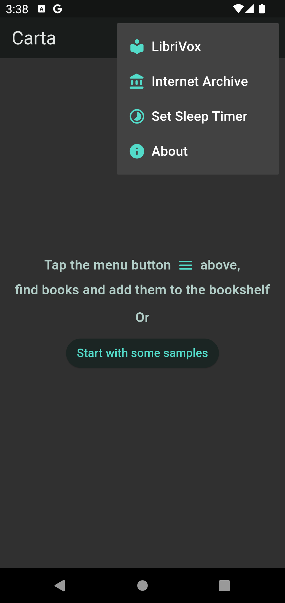
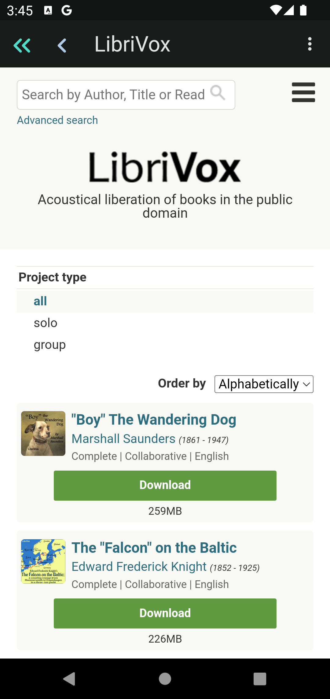
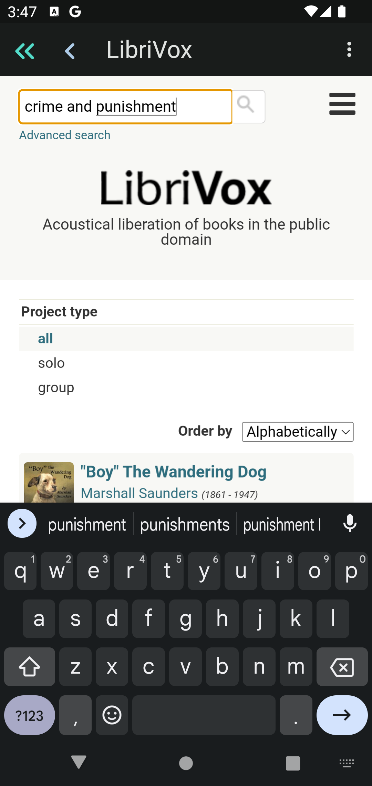

# How to Add Books from LibriVox

Tap the menu botton at the top right corner of the home screen.

<!--  -->

Select `LibriVox` menu item. This will lead you to the `LibriVox` website.

<!--  -->

Search books using `LibriVox` search menu at the top.

<!--  -->

From the search result, navigate to the book page of your choice.

<!--  -->

At the book page, `Add to my bookshelf` button will appear at the bottom.

<!--  -->

Tap the button and you will see the message `Book is on the bookshelf`.

<!--  -->

Use `<<` button at the top to return to home page, or `<` to go back to the
search result.
