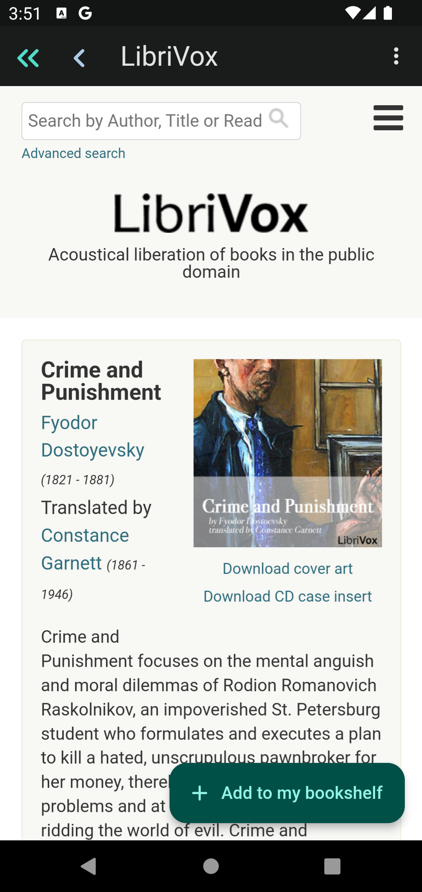
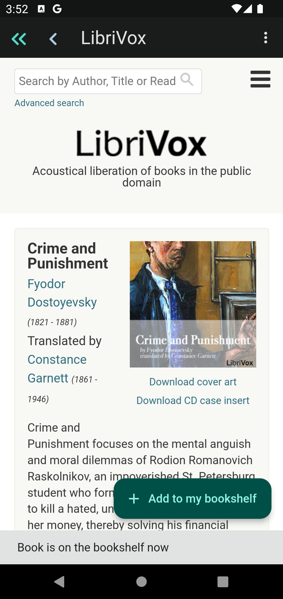

# How to Add Books from LibriVox

Tap the menu botton at the top right corner of the home screen.

Select `LibriVox` menu item. This will lead you to the `LibriVox` website.

Search books using `LibriVox` search menu at the top.

From the search result, navigate to the book page of your choice.

At the book page, `Add to my bookshelf` button will appear at the bottom.

Tap the button and you will see the message `Book is on the bookshelf`.

Use `<<` button at the top to return to home page, or `<` to go back to the
search result.
